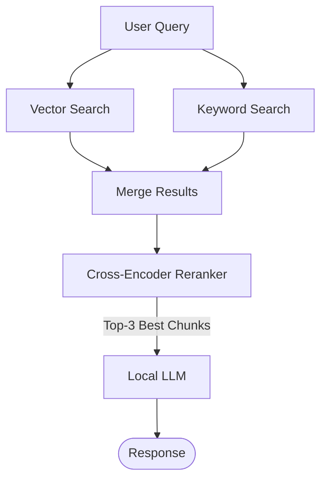

# PlayerSupport-RAG

A local RAG pipeline designed to answer player support questions for game studios. 
It uses hybrid search (ChromaDB + BM25) and Cross-Encoder reranking to retrieve relevant Q&A documentation, generates responses locally via Ollama.

---

## Tech Stack

- **Embeddings:** nomic-embed-text
- **Vector DB:** ChromaDB
- **LLM:** Llama 3.2
- **Sparse Search:** BM25
- **Reranker:** ms-marco-MiniLM-L-6-v2

---

## Data Flow

---

## Quick Start

### 1. Prerequisites

    ollama pull llama3.2
    ollama pull nomic-embed-text

### 2. Installation

    git clone https://github.com/yussuferen/PlayerSupport-RAG.git
    cd PlayerSupport-RAG
    python -m venv venv
    source venv/bin/activate
    pip install -r requirements.txt

### 3. Running

    python app.py